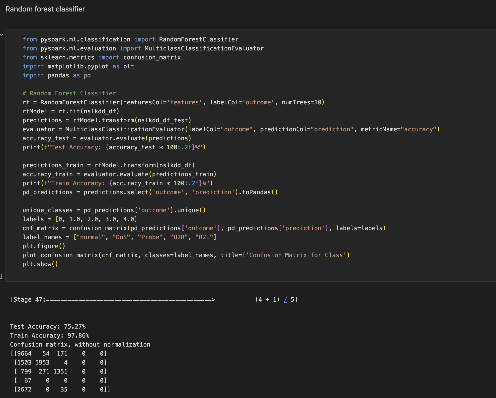
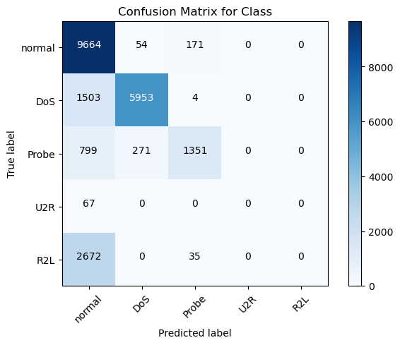
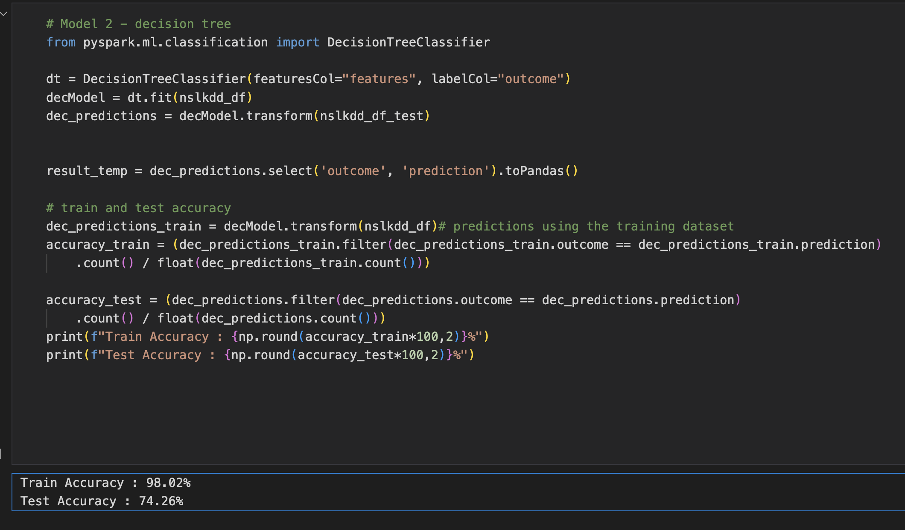
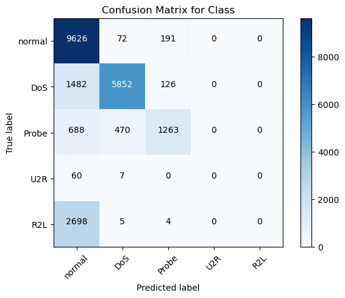
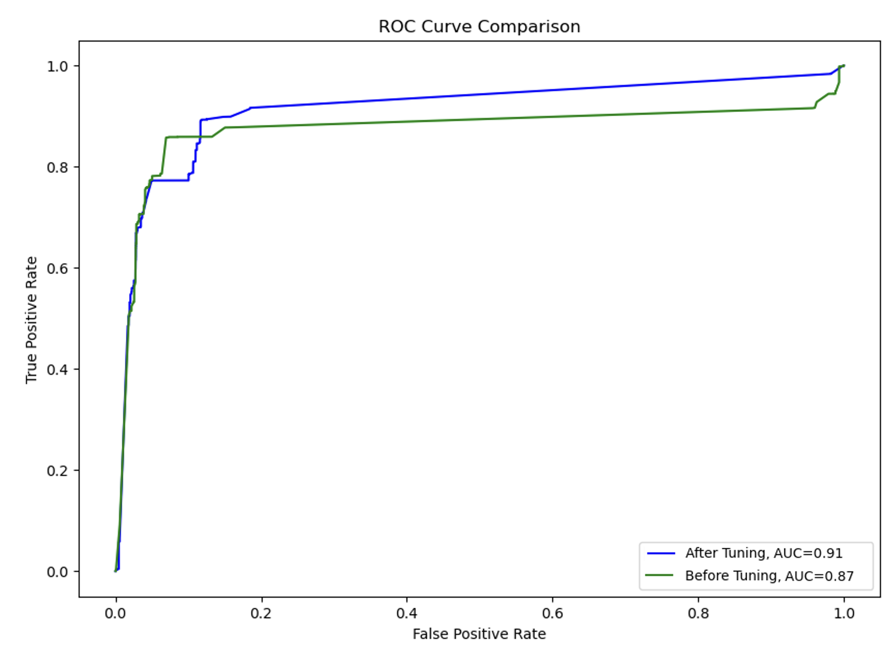

# Enhanced-Network-Intrusion-Detector-with-ML-Classification-

## Overview
In this project, I tackled a multi-class classification problem using SparkML, aiming to predict not just the presence of an attack but also its type. There were five possible categories: normal, DOS, R2L, U2R, and probing. NSL-KDD Dataset was used due to its relevance in cybersecurity and categorization of the attacks:
- Cybercrimes, involving computers or networked devices, can lead to significant physical or financial damage. The NSL-KDD dataset is crucial for understanding and identifying network intrusions, as it provides a wealth of data on both normal and malicious network activities.
- The dataset categorizes attacks into four classes: Denial of Service (DoS), Probe, User to Root (U2R), and Remote to Local (R2L). This classification aids in the development of specialized intrusion detection systems.

# Section 1: Data Preprocessing and Pipeline Creation
1.1 Pipeline and Data Engineering
I created a preprocessing pipeline that incorporated standard data engineering steps. This included data cleaning, normalization, and feature engineering. Additionally, I formulated an 'outcome' column to categorize each record into one of the five classes.

# Section 2: Model Selection and Evaluation
2.1 Model Training
I chose two different machine learning models for this task. For each model, I trained it on the training dataset, and then evaluated its performance in terms of training and testing accuracy.

2.2 Confusion Matrix
To further assess the model performance, I plotted confusion matrices for the predictions made on the test dataset.

# Section 3: Hyper-Parameter Tuning and Cross-Validation
3.1 Hyper-Parameter Identification
For each model, I identified key hyper-parameters that could significantly influence model performance.

3.2 Cross-Validation
I constructed a parameter grid for each model and conducted hyper-parameter tuning using cross-validation, focusing on accuracy as the evaluation metric.

3.3 Test Accuracy Post-Tuning
I recalculated the test accuracy after the hyper-parameter tuning to assess the improvements.

# Section 4: Model Selection Rationale and Comparison
4.1 Choice of Models and Hyper-Parameters
I explained my rationale for selecting the two machine learning models, the specific hyper-parameters chosen for tuning, and the design of the parameter grids.

4.2 Comparative Analysis
I included a discussion comparing the two models, focusing on their performance, suitability for the task, and the impact of hyper-parameter tuning.

## Results

# Accuracy for Random Forest Model 
# 

# Confusion Matrix for Random Forest Model 
# 

# Accuracy for Decision Tree Model
# 

# Confusion Matrix for Decision Tree Model 
# 

# AUC and ROC curve of tuned Gradient Boosted Tree Model
# 
